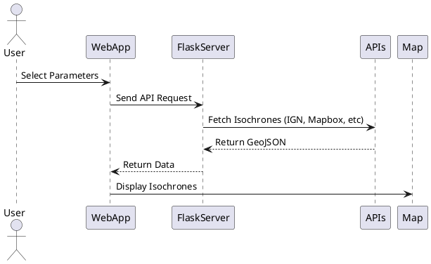
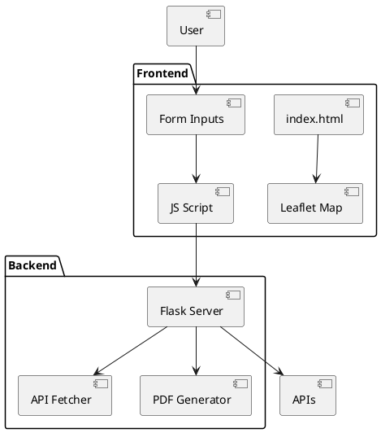
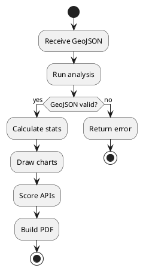

# IsoComp - Isochrone Comparison Web Application

## Overview :
**IsoComp** is a web application designed to generate and compare isochrones from four different routing APIs:

- **IGN (Géoportail)**
- **Mapbox**
- **Ciril Group GEO API**
- **Here**

Users can select a point on the map, a travel mode (car, bike, walk), and a duration, then view and compare isochrone outputs from the selected APIs based on:

- Response time
- Polygon geometry and area
- Number of polygon points
- Hausdorff distances
- Real travel distances/durations using HERE routing
- Normalized performance scores (reliability, speed, accuracy)

---

## Application Architecture :

### Project Structure
```
IsoComp/
├── static/
│   ├── css/
│   ├── js/
│   └── images/
├── templates/
│   └── index.html
├── server.py
```

### Main Technologies
| Layer      | Technologies                         |
|------------|--------------------------------------|
| Frontend   | HTML, CSS, JavaScript, Leaflet.js    |
| Backend    | Python (Flask)                       |
| APIs       | IGN, Mapbox, Here, Ciril Group       |
| Mapping    | GeoJSON, Leaflet                     |
| Reports    | Matplotlib, FPDF, Geopandas          |
| Geometry   | Shapely, SciPy (Hausdorff), NumPy    |

---

## 🎯 Features

- Isochrone generation from multiple APIs
- Customizable duration, location, transport mode
- Dynamic form interface and map visualization
- Real-time comparison with multiple metrics
- Exportable PDF and GeoJSON files
- Color-coded isochrone layers with a dynamic legend

---

## 📊 Metrics & Analysis

Each generated isochrone is analyzed and compared based on:

- ⏱ **API Response Time**
- 🌍 **Covered Area** (in km²)
- 📌 **Polygon Point Count**
- 🍅 **Hausdorff Distance** between APIs
- 🔍 **Routing Distance & Duration** via HERE
- 🔢 **Final Performance Score** (Normalized scale)

---

## 🔢 Diagrams (in PlantUML)

### High-Level Workflow


### Component Architecture


### PDF Generation Flow


---

## 📈 Outputs

- **Leaflet Map** with overlayed isochrones
- **Downloadable GeoJSON files** for each API
- **Auto-generated PDF report** including:
  - User input summary
  - Isochrone visual comparison
  - Response time table
  - Area and point count
  - Hausdorff distance matrix
  - Travel distances & durations
  - Final normalized scores

---

## 🚫 Code Confidentiality

> The source code is private and confidential. Demo and report generation are available upon request.

---

## 👤 Author

**Mohamed Rizki**  
Geomatics Engineer  
Web GIS Developer | GeoData Science Enthusiast

